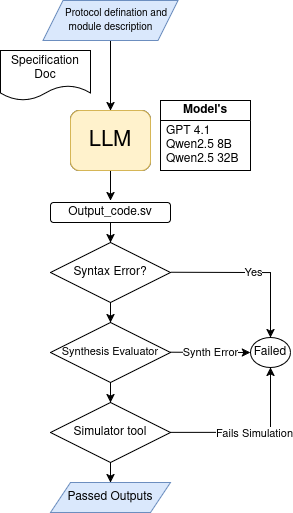

# ProtocolLLM: RTL Benchmark for SystemVerilog Generation of Communication Protocols

This Repository introduces ProtocolLLM, a benchmark suite designed to evaluate the capabilities of Large Language Models (LLMs) in generating synthesizable SystemVerilog implementations of standard communication protocols.

**Key Contributions:**

* **Novel Benchmark Suite:** ProtocolLLM includes four widely used communication protocols: SPI, I²C, UART, and AXI.
* **Diverse Code Generation Tasks:** The benchmark defines multiple tasks that capture varying levels of design abstraction and prompt specificity.
* **Comprehensive Evaluation:** Generated designs are assessed for syntactic correctness, synthesizability, and functional fidelity through waveform simulation and testbenches.
* **Analysis of LLM Capabilities:** The paper analyzes the potential and limitations of state-of-the-art LLMs for hardware description language generation, a significantly underexplored area compared to general-purpose programming languages.

**The Need:**

Hardware description languages like SystemVerilog have strict requirements regarding timing semantics, concurrency, and synthesizability. Furthermore, HDL-based design flows involve various tasks beyond just structural code generation, such as testbench development and protocol-level integration. This paper addresses the gap in understanding LLMs' applicability to these complex hardware design tasks, particularly focusing on the generation of core on-chip communication protocols.


[](https://arxiv.org/abs/2506.07945)



**Protocols Included:**

* SPI (Serial Peripheral Interface)
* I²C (Inter-Integrated Circuit)
* UART (Universal Asynchronous Receiver-Transmitter)
* AXI (Advanced eXtensible Interface)

This benchmark aims to provide the community with a standardized way to evaluate and advance the use of LLMs in hardware design automation.


**TO RUN**
* Run ```main.py``` after filling in the respective API keys.
* Run ```convert.py``` to convert the generated code into .sv files.
* Now in the respective folders of Lint and Synth run ```lint.py``` and ```synth.py```


**For more details, please refer to the full paper.**

